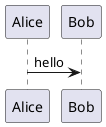

# Truss-Flavored Markdown

Truss renders chat markdown through the local parser in `src/client/markdown.tsx`.

## Supported Markdown

- Paragraphs.
- Headings from `#` through `###`.
- Unordered lists using `-`, `*`, or `+`.
- Ordered lists using `1.` or `1)`.
- Inline code using backticks.
- Bold text using `**text**`.
- Links using `[label](url)` after URL sanitization.
- Horizontal separators using `---` or `***` on a line by itself.
- Markdown tables.
- Inline Smart Events using Truss calendar syntax when Smart Events are enabled.
- Map blocks using Truss map syntax.
- Card blocks for artifact-style answers when Cards are enabled.
- Timeline blocks for event histories and progressions when Timelines are enabled.
- Follow-up prompt blocks when Follow-up prompts are enabled.
- KaTeX inline and display math when KaTeX rendering is enabled.
- Fenced code blocks using triple backticks.
- PlantUML fenced code blocks when PlantUML rendering is enabled.

Rich renderers are controlled in Settings > Rich features. Disabled rich features fall back to regular markdown rendering: tables stay regular styled HTML tables, event syntax stays text, Card, Timeline, and Follow-up syntax stay text, PlantUML stays a code block, and dollar-delimited math stays text. When Follow-up prompts are disabled, Truss also tells the model not to end messages with follow-up prompts.

## Markdown Attachments

When supported document files are attached to chat, Truss converts extractable document text to Markdown before sending it to the model. Supported converted inputs include Word documents (`.doc`, `.docx`), spreadsheets (`.xls`, `.xlsx`, `.xlsm`, `.xlsb`, `.ods`), PowerPoint decks (`.ppt`, `.pptx`), PDFs, `.odt`, and `.rtf`. The composer defaults to attaching converted documents as text. PDF attachments can also be rendered as one PNG image attachment per page, or sent as both text and image. PDF image rendering can be limited to a page range such as `1-3` or `1,3,5`. Rendering more than five page images asks for confirmation because large image batches can hurt performance or inflate pricing on cloud models. Other converted document formats attach as text; convert them to PDF first when page image rendering is needed. Image-only or scanned PDFs need image attachment because they do not contain embedded text for Markdown conversion.

Converted attachment context is prepended before the user-written prompt and includes the original file format. Text and code files are attached as text and are not sent through document conversion. Unsupported binary files show an attachment error in the composer instead of being silently ignored.

Transcript attachments open in a large preview dialog instead of downloading immediately. Text attachments display their stored text content, and image attachments display the image with Download, Crop, and Redact actions. Saving a crop or redaction updates the attachment in conversation or composer state; Download remains a separate explicit action. Editing a user message can keep, remove, add, crop, or redact attachments, and saving the edit asks whether to regenerate the affected response when later messages already exist.

Before sending, staged image attachment chips expand on hover or focus to show an inline image preview, matching the expansion behavior used by converted document attachment options.

## Tables

Markdown pipe tables render full-width. With Smart tables disabled, they render as regular styled HTML tables.
Table headers and cells render inline markdown such as bold text, inline code, links, Smart Events, and KaTeX according to the enabled rich-feature settings.

```markdown
| Name | Score | Status |
| --- | ---: | :---: |
| Ada | 94 | Ready |
| Linus | 88 | Review |
```

When Smart tables are enabled, Truss adds sorting, visible-column controls, row paging, and CSV download. The original markdown remains portable GitHub-style table markdown.

## Smart Events

Smart Events render as inline chips inside paragraphs, list items, headings, and alert bodies. Selecting the chip opens a details dialog with the title, date, start time, end time, location, and description.

```markdown
:calendar[Project kickoff]{date="2026-07-02" time="09:30" end="10:00" location="Studio" description="Planning and owners"}
```

The title inside brackets and the `date` attribute are required. `time`, `end`, `location`, and `description` are optional. Dates must use `YYYY-MM-DD`, and times must use 24-hour `HH:mm`. Malformed calendar entries render as plain text.

When enabled in Settings > Rich features, Smart Event modals can include Google Calendar links, Outlook Calendar links, and downloadable ICS files. When Smart Events are disabled, the custom syntax is not parsed and no modal is shown.

## Maps

Map blocks render an OpenStreetMap embed for latitude and longitude coordinates.

```markdown
:map[Budapest office]{lat="47.4979" lng="19.0402" zoom="13" location="Budapest, Hungary"}
```

The title inside brackets, `lat`, and `lng` are required. `zoom` defaults to `13` and is clamped to the OpenStreetMap zoom range. `location` is optional display text.

## Code Blocks

Fenced code blocks render with a header, a language label, a copy button, a save button, and lightweight syntax highlighting.

````markdown
```ts
const value = "Rendered as inert text";
```
````

The highlighter is intentionally small. It recognizes common comments, strings, numbers, keywords, function names, operators, punctuation, and simple HTML/XML tags. The original code text remains unchanged for copy and save actions.

## Horizontal Separators

Lines containing only three or more hyphens or asterisks render as a thin horizontal separator.

```markdown
First section

---

Second section

***

Third section
```

## Cards

When Cards are enabled in Settings > Rich features, Truss supports fenced Card blocks for artifact-style answer content such as rephrased passages, standalone drafts, reusable copy, or paste-ready summaries. Cards should not embed markdown tables or vertical Timeline blocks; use regular tables or Timeline blocks outside the Card instead. The header and footer are optional. Card actions appear on hover or keyboard focus and copy or download the card contents as Markdown.

```markdown
:::card title="Rephrased version" footer="Ready to paste"
Thank you for the update. I will review the changes today and send notes by tomorrow morning.
:::
```

The opening fence must start with `:::card`. Supported attributes are `title`, `header`, and `footer`, with quoted values. `title` and `header` both render as the Card header. The body can contain regular Truss-flavored markdown until a closing `:::` line. Empty or malformed Card blocks render as regular text.

## Timelines

When Timelines are enabled in Settings > Rich features, Truss supports fenced Timeline blocks for event histories, status progressions, release plans, incident summaries, approval flows, and ordered step-by-step content such as repair instructions, assembly flows, and recipes. Timeline entries render with a left rail, an icon, a date label, a bold title, and optional detail text.

```markdown
:::timeline title="Approval history"
- date="Today" title="Pending Approval" icon="inbox" description="This request requires your approval."
- date="May 19, 2018" title="Approval Requested" icon="mail" description="John Lloyd has requested your approval."
- date="2018" title="Request Created" icon="location_on" description="Request created by Kim May."
:::
```

The opening fence must start with `:::timeline`. The optional `title` or `header` attribute labels the Timeline. Each non-empty entry line must include `date` and `title` quoted attributes; `date` can be a chronological date or a procedural label such as `Step 1`, `Prep`, `Assemble`, or `Bake`. `description`, `detail`, `body`, and `icon` are optional. Icons use Material Symbols names and are sanitized before rendering. As a shorthand, entries can also use `Date | Title | Description | icon`. Empty or malformed Timeline blocks render as regular text.

## Follow-Up Prompts

When Follow-up prompts are enabled in Settings > Rich features, Truss supports fenced follow-up blocks at the end of assistant answers. They do not render inside the assistant message. Instead, Truss shows up to three prompt lines as an extension above the docked composer.

```markdown
:::followups
- Make this more concise
- Turn this into an email
- Give me a more formal version
:::
```

The opening fence must be `:::followups` or `:::follow-ups`. Each non-empty line becomes one follow-up prompt, with optional markdown-style list markers removed. Truss uses the first three valid prompts and ignores any additional lines. Malformed follow-up blocks render as regular text.

## PlantUML

When PlantUML rendering is enabled, fenced `plantuml` or `puml` code blocks render through the configured PlantUML server. The default server is the official PlantUML server.

The default PlantUML prompt guidance asks models to emit valid multiline fenced `plantuml` blocks with `@startuml` and `@enduml`, use the Truss palette `#242421`, `#8C8370`, `#D96C4A`, and `#F9F7F2`, and include the default sequence-diagram directives:

```plantuml
autonumber
skinparam style strictuml
skinparam DefaultFontName Calibri
skinparam RoundCorner 3
title **<Diagram Title>**
header "<Header Text>"
```

For sequence diagrams, the default guidance also asks models to use `++` and `--` on arrows for activation bars, `... <description> ...` for dividers, `->` for normal calls, `-->` for return or async responses, and `-[#red]->` for error responses.

````markdown

````

When PlantUML rendering is disabled, the same fence renders as a normal code block.

## KaTeX

When KaTeX rendering is enabled, inline math uses `$...$` and display math uses `$$...$$`.

```markdown
The Gamma function satisfies $\Gamma(n) = (n-1)!$.

$$
\Gamma(z) = \int_0^\infty t^{z-1}e^{-t}dt\,.
$$
```

Malformed math falls back to inert text.

## Alerts

When callouts are enabled in Settings > Rich features, Truss supports GitHub flavored markdown alerts for notes, tips, important information, warnings, and cautions. When disabled, the same syntax remains regular markdown text.

```markdown
> [!NOTE]
> Useful information that users should know, even when skimming content.

> [!TIP]
> Helpful advice for doing things better or more easily.

> [!IMPORTANT]
> Key information users need to know to achieve their goal.

> [!WARNING]
> Urgent info that needs immediate user attention to avoid problems.

> [!CAUTION]
> Advises about risks or negative outcomes of certain actions.
```

The compact form is also accepted:

```markdown
> [!NOTE]> Useful information that users should know, even when skimming content.
```

## Security Behavior

- Raw HTML is rendered as text, not as browser HTML.
- Links are sanitized before rendering.
- Card actions copy or download only local text generated from the card content.
- Timeline blocks render parsed text and Material Symbols icon names without interpreting raw HTML.
- Follow-up prompt buttons copy their text into the local composer draft.
- Code blocks are never evaluated by the renderer.
- PlantUML diagrams and maps load external image or iframe resources from their configured services.
- KaTeX output is generated locally as MathML from the `katex` package.
- See `docs/security.md` for the current security controls.
